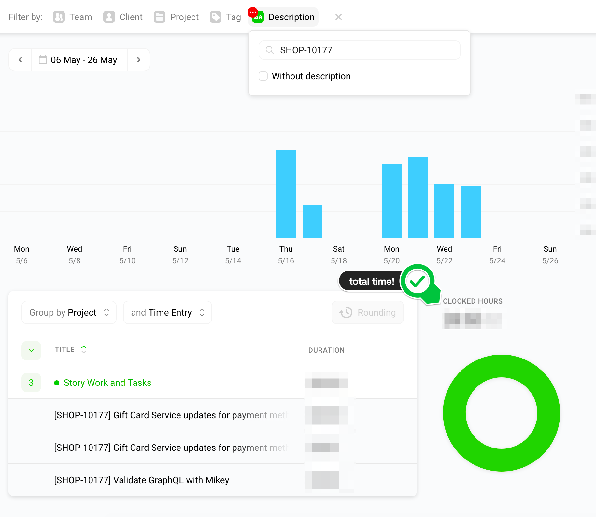

# Work Smarter :thinking:, not harder :hammer:

Ben Limmer
@blimmer

May 28, 2019

***

:neutral_face:

## ...another talk on "productivity"?

---

### This talk isn't about

- Working more hours :clock6:

- Taking less breaks :no_good: :palm_tree:

- Being heads down 100% of the time :headphones:

- Productivity shame :shame:

---

### Productivity Shame

> “Like battery acid, productivity shame is a toxic substance that slowly corrodes your ability to take any joy in your work.”
>
> \- Jocelyn K. Glei (RESET course)

---

### This talk is about

- Ways to **stay focused** and produce your best work :triumph:

- Leveraging the natural ebbs and flows in your productivity :wavy_dash:

- Self awareness while developing a story :point_right: :smile: :point_left:

---

### Disclaimer

These are things that work well for me, and I've seen them work well for some folks. If they don't work for you, that's OK!

***

# Talk Outline

- Staying Focus
  - Time tracking
  - Notification management

***

# Staying Focused

---

### Distractions!

- Open office (collaboration benefits are a [myth](https://royalsocietypublishing.org/doi/full/10.1098/rstb.2017.0239))

- Notifications (slack, email, apps on your phone)

---

### Coping Mechanisms

- Time tracking :alarm_clock:

- Reduce distractions :cyclone: :smile: :cyclone:

***
***

### Time Tracking

> What task am I tracking time against *right now*?

---

---

### Why Time Tracking?

---

### Data!
:bar_chart:

---

### Time Tracking Data

- What am I spending time on?

- Am I dedicating time appropriately between categories?

- Do I want to take the time to switch categories?

---

---

---

---

# toggl.com

---

# :question:
## on time tracking?

***
***

## Reducing distractions

:cyclone: :smile: :cyclone:

---

## Reducing distractions

- Change your scenery
- Mute notifications

---

## Change your scenery

:house_with_garden: :coffee:

---

## Change your scenery

- Increase creative output
- Execute without IRL distractions
- Have more control over your environment

---

## Mute notifications

:zap: :iphone: :zap:

---

## Mute notifications

- Snooze slack notifications
- Do Not Disturb mode on your phone
- MacOS global notifications
- Let folks know / build in time to "catch up"

---

# :question:
## on reducing distractions?

***
***

## Optimizing Story Work & Tasks

:pencil: :chart_with_upwards_trend:

---

## Optimizing Story Work & Tasks

- Planning
- Avoiding Rabbit Holes
- Asking for Help

---

### Planning

Think of two stories:

- one that you knocked out quickly
- one that took much longer than expected

What were some characteristics of the stories that took longer?

---

### Planning + Acceptance Criteria

Takes a good amount of time but, pays dividends during execution.

---

### Planning + Acceptance Criteria

- What, specifically, is in-scope
- What's out of scope
- Point or estimate work size (timebox)
- Leverage experience on the team

---

### Planning

> Planning takes too much time. I should be writing code.
> \- Everyone

---

### Planning + Time Tracking

Scenario:

- 1 hour planning once per sprint
- ((20 hours / week coding) * 2 week sprints)
- = **2%** of your coding time

---

### Planning + Time Tracking

Scenario:

- 2.5 hour planning once per sprint
- ((20 hours / week coding) * 2 week sprints)
- = **6%** of your coding time

---

### Planning + Reading Code

- Plan the approach **before** writing any code
- Much easier to parallelize options in your brain vs. in code
- Take notes!

---

### Writing Code + Rabbit Holes

---

### Writing Code + Rabbit Holes

- Awareness of time spent (time tracker)
- Questions to ask yourself

---

### Rabbit Hole Question 1

On this train of thought what __am I learning__?

---

### Rabbit Hole Question 1

On this train of thought what __am I learning__?

- Wat ...
  - why am I on this blog post!?
- Something needed to deliver the story ...
  - Have you learned enough to deliver the story?

---

### Rabbit Hole Question 2

On this train of thought what __problem am I solving__?

---

### Rabbit Hole Question 2

On this train of thought what __problem am I solving__?

- Is it in the acceptance criteria?
- Do I need to solve it now?

---

### Rabbit Hole Question 3

On this train of thought what __am I optimizing__?

---

### Rabbit Hole Question 3

On this train of thought what __am I optimizing__?

- Is it a valuable optimization?
- Is it too early to worry about this?

---

### Rabbit Hole Questions

On the train of thought what:

- am I learning?
- problem am I solving?
- am I optimizing?
