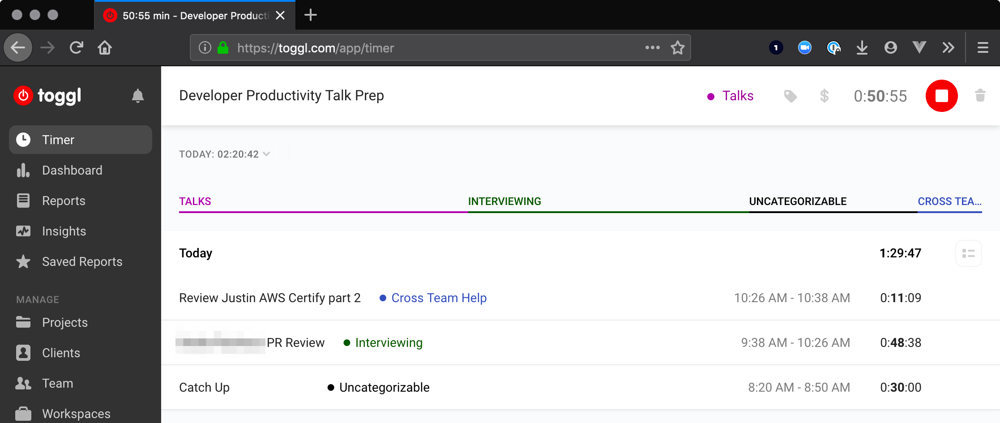

# Maximize your Output
(sans "productivity shame")

Ben Limmer
@blimmer

May 28, 2019

***

:neutral_face:

## ...another talk on "productivity"?

---

### This talk isn't about

- Working more hours :clock6:
- Becoming a Pomodoro master :tomato:
- Being heads down 100% of the time :headphones:
- Productivity shame :worried:

---

### Productivity shame

> "Productivity Shame" is the act of regularly setting unrealistic expectations for what you can accomplish, and then beating yourself up when you fall short.
>
> \- Jocelyn K. Glei

---

### Productivity shame

> “Like battery acid, productivity shame is a toxic substance that slowly corrodes your ability to take any joy in your work.”
>
> \- Jocelyn K. Glei

---

### This talk is about

- Tips to **stay focused** and produce your best work :muscle: :triumph:
- Understanding and hacking natural ebbs and flows in your productivity :wavy_dash:
- Tips to **stay on track** when delivering a story :point_right: :smile: :point_left:

---

### Disclaimer

These are things that work well for me, and I've seen them work well for other folks. If they don't work for you, that's OK!

Breaks in each section are **not only for questions**, please also **provide your experience and tips**!

***

# Talk Outline

- Staying Focused
  - Time tracking
  - Reducing distractions
  - Ebbs and flows of productivity
- Optimizing Story Work & Tasks
  - Planning
  - Rabbit Holes
  - Asking for Help

***

# Staying Focused

---

### Staying focused

- Time tracking :alarm_clock:
- Reduce distractions :cyclone: :smile: :cyclone:
- Leverage ebbs and flows :cactus: :left_right_arrow: :ocean:

***
***

### Time Tracking

---

### Time Tracking

> What task am I tracking time against *right now*?

---

---

### Why Time Tracking?

---

### Data!
:bar_chart:

---

### Time Tracking Data

- What am I spending time on?
- Am I dedicating time appropriately between categories?
- Am I stuck and haven't realized it yet?

---

---

---

---

### toggl.com

- The tool I use
- Free
- Plenty of alternatives!

***
***

## Reducing distractions

:cyclone: :smile: :cyclone:

---

## Reducing distractions

- Change your scenery
- Mute notifications

---

## Change your scenery

:house_with_garden: :coffee:

---

## Change your scenery

- Increase creative output
- Execute without IRL distractions
- Have more control over your environment

---

## Mute notifications

:zap: :iphone: :zap:

---

## Mute notifications

- Snooze slack notifications
- Do Not Disturb mode on your phone
- Turn off macOS global notifications
- Let folks know / build in time to "catch up"

***
***

## Leveraging Ebbs and Flows

:cactus: :left_right_arrow: :ocean:

---

## Leveraging Ebbs and Flows

- We are not machines :robot:
- What supports your mood and productivity? :runner: :video_game:
- When are you most productive? :sun_with_face: :new_moon_with_face:

---

[source](https://medium.com/the-mission/heat-map-your-schedule-to-boost-productivity-4e2e50ffd1d9)

---

## Leveraging Ebbs and Flows

- Be aware of your natural productivity rhythm and harness it
- Take quick breaks, even when you're feeling productive
- Write a note before your break to get back into it quickly

---

## Discussion time!

- Time tracking :alarm_clock:
- Reducing distractions :cyclone: :smile: :cyclone:
- Leveraging ebbs and flows :cactus: :left_right_arrow: :ocean:

***
***

# Halfway there!

- ~~Staying Focused~~
  - ~~Time tracking~~
  - ~~Reducing distractions~~
  - ~~Ebbs and flows of productivity~~
- Optimizing Story Work & Tasks
  - Planning
  - Rabbit Holes
  - Asking for Help

***
***

## Optimizing Story Work & Tasks

- Planning :pencil:
- Rabbit Holes :rabbit: :hole:
- Asking For Help :raising_hand: :question: :information_desk_person:

---

### Planning

Think of two stories:

- one that you executed against quickly
- one that took much longer than expected

What were some characteristics of the stories that took longer?

---

### Planning + Acceptance Criteria

Takes a good amount of time but, pays dividends during execution.

---

### Planning + Acceptance Criteria

- What, specifically, is in-scope
- What's out of scope
- Point or estimate work size
- Leverage experience on the team

---

### Planning

> Planning takes too much time. I should be writing code.
>
> \- Everyone

---

### Planning as a % of your time

Scenario:

- 1 hour planning once per sprint
- 20 hours per week coding * 2 week sprints
- = **2%** of your coding time

---

### Planning as a % of your time

Scenario:

- 2.5 hour planning once per sprint
- 20 hours per week coding * 2 week sprints
- = **6%** of your coding time

---

### Planning as a % of your time

- Take the time to get acceptance criteria locked in
- Alignment as a team
- :pray: Heather Daymon for enlightening me

---

### Planning + Reading Code

- Plan the approach **before** writing any code
- Much easier to parallelize options in your brain vs. in code
- Take notes!
- Start writing when you have a plan

---

### Rabbit Holes

---

### Rabbit Holes

- Questions to ask yourself
- Awareness of time spent

---

### Rabbit Hole Questions

On the train of thought what:

- am I learning?
- problem am I solving?
- am I optimizing?

---

### Rabbit Hole Question 1

On this train of thought what __am I learning__?

---

### Rabbit Hole Question 1

On this train of thought what __am I learning__?

- Wat ...
  - how did I get to this blog post / wiki page?
- Something needed to deliver the story ...
  - Have you learned enough to deliver the story?
  - Is there more to learn later?

---

### Rabbit Hole Question 2

On this train of thought what __problem am I solving__?

---

### Rabbit Hole Question 2

On this train of thought what __problem am I solving__?

- Is it in the acceptance criteria?
- Do I need to solve it now?

---

### Rabbit Hole Question 3

On this train of thought what __am I optimizing__?

---

### Rabbit Hole Question 3

On this train of thought what __am I optimizing__?

- Is it a valuable optimization?
- Is it too early to worry about this?

---

### Rabbit Hole Questions

On the train of thought what:

- am I learning?
- problem am I solving?
- am I optimizing?

---

### Rabbit Holes + Time Tracking

> Wait, I've spent how many hours on this so far!?
> \- Me, in a rabbit hole

---

### Rabbit Holes + Time Tracking

- Data from time tracker invaluable
- Compare to team estimation - are you way off? why?
- Work to reduce your MTTD that you're in a rabbit hole

***
***

## Asking for Help

:raising_hand: :question: :information_desk_person:

---

## Asking a Contextual Question

- Ask your question, also provide context
  - What do you already understand?
  - What have you tried?
- Get stuck for **more than 15 minutes**, but **less than an hour**

---

## Discussion time!

- Planning :pencil:
- Rabbit Holes :rabbit: :hole:
- Asking For Help :raising_hand: :question: :information_desk_person:

***
***

***
***
